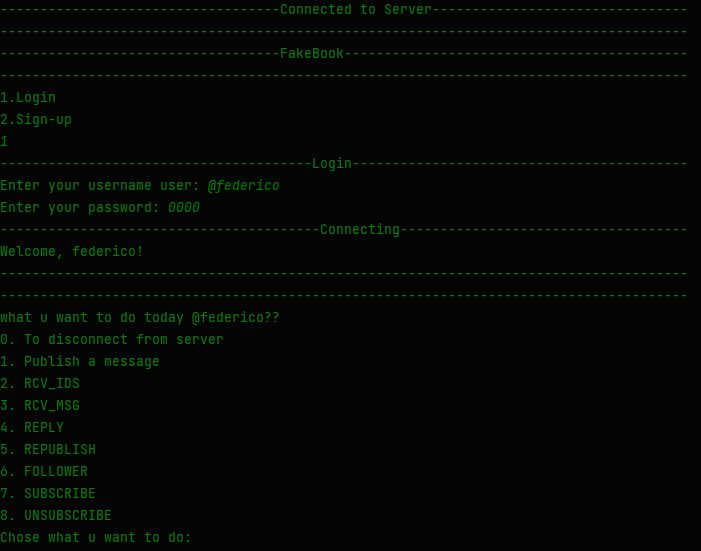
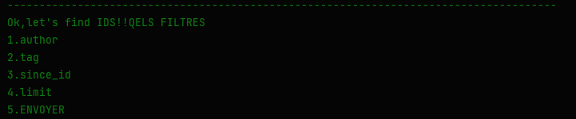

<div style="font-size:1.2rem" >
Group 3_18 <br>
SUAREZ Federico <br>
AIT-RAZZOUK Lina
</div>

<center>


#FAKEBOOK


---------------------------

### `Welcome to FAKEBOOK`

---

##`instructions dutilisation`
<div dir="ltr" align="left" style="margin: 0 25%"> 
    <ul style="font-size: 1.2rem;">
    <li>Créer une basse de donnes MySql PROJECT dans localhost. (regarder le code sql à la fin du README) </li> 
    <li>Lancer LaunchServer.java</li> 
    <li>Lancer Main.java dans Client</li>
</ul> 
</div>



<div style="font-size: 1.2rem;">

Utliser le clavier pour faire des choix, tout ce qui est sur le tableau de bord est fonctionnel

</div>



<div style="font-size: 1.2rem;">

Utiliser le clavier pour faire des choix,<br>
on peut faire des recherches avec plusieurs filtres.<Br>
Pour faire cela tapez sur le filtre desire entre votre choix, recommencez. <Br> 
Quand vous êtes sûr de vos choix taper sur le 5 pour envoyer la requête

</div>


</center>

## MySql code pour créer la base de données :
```mysql
CREATE DATABASE PROJECT;

DROP TABLE messages;
DROP TABLE users;

CREATE TABLE users  (
id INT PRIMARY KEY NOT NULL AUTO_INCREMENT,
username VARCHAR(30) NOT NULL,
password VARCHAR(30) NOT NULL
);

CREATE TABLE messages  (
id INT PRIMARY KEY  NOT NULL AUTO_INCREMENT,
usernameID INT NOT NULL,
username VARCHAR(30) NOT NULL,
message VARCHAR(255) NOT NULL,
CONSTRAINT FK_usernameIdMessages FOREIGN KEY messages(usernameID) REFERENCES users(id)
);

INSERT INTO USERS (username,password) VALUES("@fedeCode","0000");
INSERT INTO USERS (username,password) VALUES("@test","123");
INSERT INTO USERS (username,password) VALUES("@test2","123a");
INSERT INTO messages (usernameID, username, message)
SELECT id, '@test', 'holaaaaaaa' FROM users
WHERE username = '@test';
INSERT INTO messages (usernameID, username, message)
SELECT id, '@federico', 'hello fede' FROM users
WHERE username = '@federico';

SELECT * from messages;
SELECT * from users;
SELECT * From users join messages where messages.usernameID = users.id;
SELECT max(id) from messages;
SELECT max(id) from users;
```


